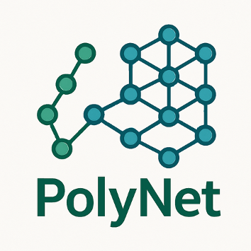

# PolyNet

***

# Introduction

*PolyNet* is a python module designed for quantitative structure activity relationships model development. For this end, a csv containing the *SMILES* strings representation of the composing monomers and target variable to model must be provided. Current features include: data analysis tools, calculation of molecular descriptors, creation of graph representations of molecules, GNN model training, and explainable AI functions.

PolyNet is still in an early development stage.

# Dependencies

[Python](https://www.python.org/) > v. 3.11

The Python dependencies are listed in requirements.txt and can be installed using either pip or conda.

# Installation

To install, copy the repository on your own device by typing:

`git clone https://github.com/Biomaterials-for-Medical-Devices-AI/PolyNet.git`

Then, install poetry on your python environment:
`pip install poetry`

Create a virtual environment by running:

`poetry intall`

This virtual environment will contain all of the developed code as well as its dependencies. Lastly, activate your virtual environment:

`source .venv/bin/activate`

Then your enviroment will be ready to start running experiments!
